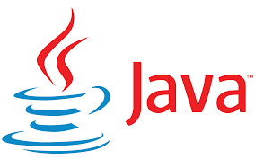
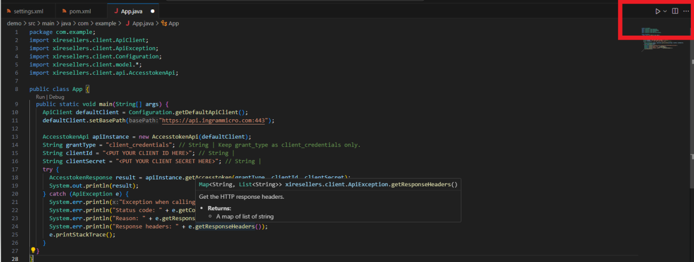
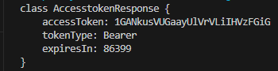
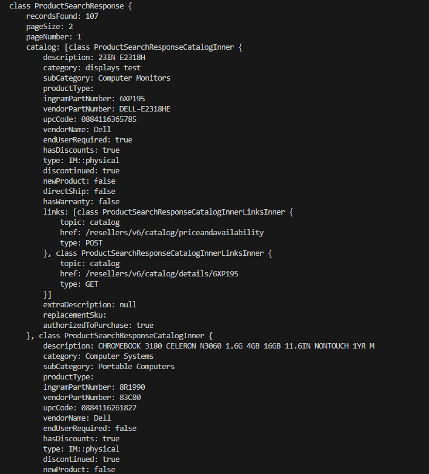

# XI SDK Quickstart for Java



[Repository GitHub](https://github.com/ingrammicro-xvantage/xi-sdk-resellers-java)

[SDK document](https://github.com/ingrammicro-xvantage/xi-sdk-resellers-java/tree/main/docs)

[Package Url](https://github.com/ingrammicro-xvantage/xi-sdk-resellers-java/packages/2080874)

### Installation

#### Steps:
1. **Install Maven**: Ensure that Maven is installed on your system. You can download it from the Apache Maven website and follow the installation instructions for your operating system.

2. **Set up Environment Variables**: Add Maven's bin directory to your system's PATH environment variable. This step is optional but can make it easier to use Maven from the command line.

3. **Create Project Directory**: Choose or create a directory where you want to create your Maven project. This directory will contain your project's source code, configuration files, and other resources.

4. **Generate Maven Project Skeleton**: Open a terminal or command prompt and navigate to the project directory. Then, run the following Maven command to generate a new Maven project skeleton:
```
mvn archetype:generate -DgroupId=com.example -DartifactId=my-project -DarchetypeArtifactId=maven-archetype-quickstart -DinteractiveMode=false
```

* `-DgroupId`: This is the group ID for your project, usually in reverse domain name notation (e.g., com.example).

* `-DartifactId`: This is the unique identifier for your project (e.g., my-project).

* `-DarchetypeArtifactId`: This specifies the Maven archetype to use for generating the project. In this case, we're using maven-archetype-quickstart, which is a basic archetype for Java projects. 

5. **Navigate to Project Directory**: Once the Maven command completes, navigate into the directory of the newly created project.

6. **Review Project Structure**: Take a moment to review the project structure and files generated by Maven. You should see directories like src/main/java for your Java source code, src/test/java.

7. **Edit** `pom.xml`: Open the `pom.xml` file in a text editor to configure dependencies, plugins, and other settings for your project. You can add dependencies, specify the Java version, configure plugins, and more in this file.

8. In the dependencies add the following:

```
<dependency>
  <groupId>xi.sdk.resellers</groupId>
  <artifactId>xi.sdk.resellers</artifactId>
  <version>1.0.0</version>
</dependency>
```
9. Create `settings.xml` file: Create a file named `settings.xml` in the `.m2` directory in your user's home directory. If the `.m2` directory doesn't exist, you can create it. If settings.xml is already present you can modify it.

```
<settings xmlns="http://maven.apache.org/SETTINGS/1.0.0"
  xmlns:xsi="http://www.w3.org/2001/XMLSchema-instance"
  xsi:schemaLocation="http://maven.apache.org/SETTINGS/1.0.0
                      http://maven.apache.org/xsd/settings-1.0.0.xsd">

  <activeProfiles>
    <activeProfile>github</activeProfile>
  </activeProfiles>

  <profiles>
    <profile>
      <id>github</id>
      <repositories>
        <repository>
          <id>central</id>
          <url>https://repo1.maven.org/maven2</url>
        </repository>
        <repository>
          <id>github</id>
          <url>https://maven.pkg.github.com/ingrammicro-xvantage/xi-sdk-resellers-java</url>
          <snapshots>
            <enabled>true</enabled>
          </snapshots>
        </repository>
      </repositories>
    </profile>
  </profiles>

  <servers>
    <server>
      <id>github</id>
      <username><ENTER YOUR GITHUB USER ID></username> ///Replace with your user id 
      <password><ENTER YOUR ACCESS TOKEN</password> /// Get access token from developer settings in your profile. 
    </server>
  </servers>
</settings>
```
10. **Add Configuration**: Copy the provided XML configuration into the settings.xml file. Replace username with your GitHub username and password with your GitHub personal access token. To generate a Personal Access Token for GitHub, navigate to your Developer Settings in your GitHub profile.

11. **Save the File**: Save the `settings.xml` file.

12. After updating the `settings.xml` file, you can run `mvn install` from the root directory of your Maven project. This command will trigger the installation of dependencies and artifacts.
 
### Usage:
#### Steps:
1. Open `App.java` in your text editor and write Java code. Below is an example to retrieve the access token:


```java
package com.example;

import xiresellers.client.ApiClient;
import xiresellers.client.ApiException;
import xiresellers.client.Configuration;
import xiresellers.client.model.*;
import xiresellers.client.api.AccesstokenApi;

public class App {
  public static void main(String[] args) {
    ApiClient defaultClient = Configuration.getDefaultApiClient();
    defaultClient.setBasePath("https://api.ingrammicro.com:443");

    AccesstokenApi apiInstance = new AccesstokenApi(defaultClient);
    String grantType = "client_credentials"; // String | Keep grant_type as client_credentials only.
    String clientId = "<PUT YOUR CLIENT ID HERE>"; // String | 
    String clientSecret = "<PUT YOUR CLIENT SECRET HERE>"; // String | 
    try {
      AccesstokenResponse result = apiInstance.getAccesstoken(grantType, clientId, clientSecret);
      System.out.println(result);
    } catch (ApiException e) {
      System.err.println("Exception when calling AccesstokenApi#getAccesstoken");
      System.err.println("Status code: " + e.getCode());
      System.err.println("Reason: " + e.getResponseBody());
      System.err.println("Response headers: " + e.getResponseHeaders());
      e.printStackTrace();
    }
  }
}
```
* Replace ClientId with your ClientId.
* Replace ClientId with your Client secret.

2. **Run your Application**: Run the application by clicking on the run icon on the top right corner of the `App.java` file.



If Everything is correct you will get something like this:



Here is Another Example of a Product Search Response:

```java
package com.example;
import java.util.Arrays;
import java.util.List;

// Import classes:
import xiresellers.client.ApiClient;
import xiresellers.client.ApiException;
import xiresellers.client.Configuration;
import xiresellers.client.auth.*;
import xiresellers.client.model.*;
import xiresellers.client.api.ProductCatalogApi;

public class App {
  public static void main(String[] args) {
    ApiClient defaultClient = Configuration.getDefaultApiClient();
    defaultClient.setBasePath("https://api.ingrammicro.com:443/sandbox");
    
    // Configure OAuth2 access token for authorization: application
    OAuth application = (OAuth) defaultClient.getAuthentication("application");
    application.setAccessToken("<PUT YOUR TOKEN HERE>");

    ProductCatalogApi apiInstance = new ProductCatalogApi(defaultClient);
    String imCustomerNumber = "20-222222"; // String | Your unique Ingram Micro customer number
    String imCorrelationID = "fbac82ba-cf0a-4bcf-fc03-0c5084"; // String | Unique transaction number to identify each transaction accross all the systems
    String imCountryCode = "US"; // String | Two-character ISO country code.
    Integer pageNumber = 1; // Integer | Current page number. Default is 1
    Integer pageSize = 3; // Integer | Number of records required in the call - max records 100 per page
    String imSenderID = "IMCEP"; // String | Sender Identification text
    String type = "IM::physical"; // String | The SKU type of product. One of Physical, Digital, or Any.
    String hasDiscounts = "true"; // String | Specifies if there are discounts available for the product.
    List<String> vendor = Arrays.asList(); // List<String> | The name of the vendor/manufacturer of the product.
    List<String> vendorPartNumber = Arrays.asList(); // List<String> | The vendors part number for the product.
    String acceptLanguage = "en"; // String | Header to the API calls, the content will help us identify the response language.
    String vendorNumber = ""; // String | Vendor number of the product
    List<String> keyword = Arrays.asList(); // List<String> | Keyword search,can be ingram part number or vendor part number or product title or vendor nameKeyword search. Can be Ingram Micro part number, vender part number, product title, or vendor name.
    String category = ""; // String | The category of the product. Example: Displays.
    String skipAuthorisation = "true"; // String | This parameter is True when you want Skip the authorization, so template will work like current B2b template.
    try {
      ProductSearchResponse result = apiInstance.getResellerV6Productsearch(imCustomerNumber, imCorrelationID, imCountryCode, pageNumber, pageSize, imSenderID, type, hasDiscounts, vendor, vendorPartNumber, acceptLanguage, vendorNumber, keyword, category, skipAuthorisation);
      System.out.println(result);
    } catch (ApiException e) {
      System.err.println("Exception when calling ProductCatalogApi#getResellerV6Productsearch");
      System.err.println("Status code: " + e.getCode());
      System.err.println("Reason: " + e.getResponseBody());
      System.err.println("Response headers: " + e.getResponseHeaders());
      e.printStackTrace();
    }
  }
}
```
If everything is correct you will get something like this:

